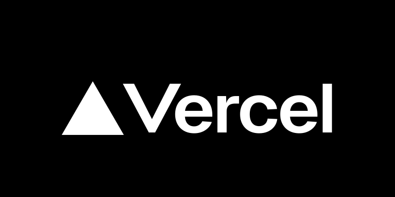
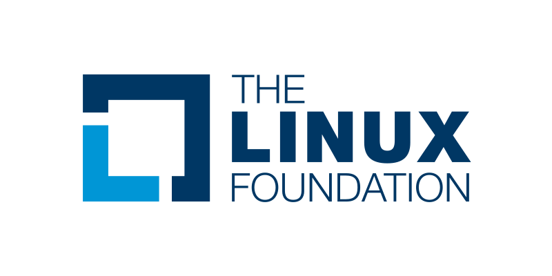

> Light, fast, dependency-free JavaScript syntax highlighter for the web and the terminal

[](https://badge.fury.io/js/@speed-highlight%2Fcore) 
   

**Used by**

<table>
<tr>
<td align="center">

</td>
<td align="center">

</td>
<td align="center">

</td>
<td align="center">

</td>
</tr>
<tr>
<td align="center">

</td>
<td align="center">

</td>
<td align="center">

</td>
<td align="center">

</td>
</tr>
</table>


<p align="center">
	<a href="https://speed-highlight.github.io/core/">Documentation</a> |
	<a href="https://speed-highlight.github.io/core/demo">Demo</a>
</p>

- **Tiny** <small>(~2kB core, ~1kB per language)</small>
- **Fast** <small>(outperforms Prism and highlight.js)</small>
- **Simple** <small>(zero dependencies)</small>

## Installation

```bash
npm i @speed-highlight/core
```

## For the Web

**1. Add a theme**

```html
<link rel="stylesheet" href="https://unpkg.com/@speed-highlight/core/dist/themes/default.css">
```

**2. Mark your code blocks**

```html
<div class="shj-lang-js">console.log('Hello')</div>
```

**3. Highlight**

```html
<script type="module">
  import { highlightAll } from 'https://unpkg.com/@speed-highlight/core/dist/index.js';
  highlightAll();
</script>
```

With npm/bundler:

```js
import { highlightAll } from '@speed-highlight/core';
highlightAll();
```

→ [Full Web Guide](https://speed-highlight.github.io/core/web)

## For the Terminal

Terminal output via ANSI escape codes.

**Node.js**

```js
import { setTheme, printHighlight } from '@speed-highlight/core/terminal';

setTheme('default');
printHighlight('console.log("hello")', 'js');
```

**Deno**

```js
import { setTheme, printHighlight } from 'https://deno.land/x/speed_highlight_js/dist/terminal.js';

await setTheme('default');
printHighlight('console.log("hello")', 'js');
```

→ [Full Terminal Guide](https://speed-highlight.github.io/core/terminal)

## API Overview

| Function | Description |
|----------|-------------|
| `highlightAll()` | Highlight all `shj-lang-*` elements |
| `highlightElement(el, lang?, mode?, opts?)` | Highlight a specific element |
| `highlightText(code, lang)` | Get highlighted HTML string |
| `detectLanguage(code)` | Auto-detect language |
| `loadLanguage(name, def)` | Register custom language |

→ [Full API Reference](https://speed-highlight.github.io/core/api)

## Switching from Prism or highlight.js?

| Feature | Speed Highlight | Prism | highlight.js |
|---------|-----------------|-------|--------------|
| Core size | ~2kB | ~17kB | ~40kB |
| Dependencies | 0 | 0 | 0 |
| Languages | 35 | 290+ | 190+ |
| Terminal support | ✅ Built-in | ❌ | ❌ |

→ [Prism Migration Guide](https://speed-highlight.github.io/core/vs-prism) | [highlight.js Migration Guide](https://speed-highlight.github.io/core/vs-highlightjs)

## Languages

| Name       | Class               | Detection |
| ---------- | ------------------- | --------- |
| JavaScript | `shj-lang-js`       | ✅ |
| TypeScript | `shj-lang-ts`       | ✅ |
| Python     | `shj-lang-py`       | ✅ |
| Rust       | `shj-lang-rs`       | ✅ |
| Go         | `shj-lang-go`       | ✅ |
| Java       | `shj-lang-java`     | ✅ |
| C          | `shj-lang-c`        | ✅ |
| HTML       | `shj-lang-html`     | ✅ |
| CSS        | `shj-lang-css`      | ✅ |
| JSON       | `shj-lang-json`     | ❌ |
| Bash       | `shj-lang-bash`     | ✅ |
| SQL        | `shj-lang-sql`      | ✅ |
| Markdown   | `shj-lang-md`       | ✅ |
| YAML       | `shj-lang-yaml`     | ❌ |
| TOML       | `shj-lang-toml`     | ❌ |
| Docker     | `shj-lang-docker`   | ✅ |
| Makefile   | `shj-lang-make`     | ✅ |
| Diff       | `shj-lang-diff`     | ✅ |
| XML        | `shj-lang-xml`      | ✅ |
| Lua        | `shj-lang-lua`      | ✅ |
| Perl       | `shj-lang-pl`       | ✅ |
| Assembly   | `shj-lang-asm`      | ✅ |
| HTTP       | `shj-lang-http`     | ✅ |
| URI        | `shj-lang-uri`      | ✅ |
| Regex      | `shj-lang-regex`    | ❌ |
| INI        | `shj-lang-ini`      | ❌ |
| CSV        | `shj-lang-csv`      | ❌ |
| Log        | `shj-lang-log`      | ❌ |
| Git        | `shj-lang-git`      | ❌ |
| JSDoc      | `shj-lang-jsdoc`    | ❌ |
| Brainfuck  | `shj-lang-bf`       | ❌ |
| Todo       | `shj-lang-todo`     | ❌ |
| Plain      | `shj-lang-plain`    | ❌ |
| Leanpub MD | `shj-lang-leanpub-md` | ❌ |

→ [Full Language List](https://speed-highlight.github.io/core/languages)

## Themes

| Theme              | Terminal | Web |
| ------------------ | -------- | --- |
| default            | ✅       | ✅  |
| github-dark        | ❌       | ✅  |
| github-light       | ❌       | ✅  |
| github-dim         | ❌       | ✅  |
| atom-dark          | ✅       | ✅  |
| visual-studio-dark | ❌       | ✅  |

→ [Themes Guide](https://speed-highlight.github.io/core/themes) | [Styling Guide](https://speed-highlight.github.io/core/styling)

## License

Speed Highlight is released under the [CC0 1.0 Universal license](LICENSE) (public domain).
